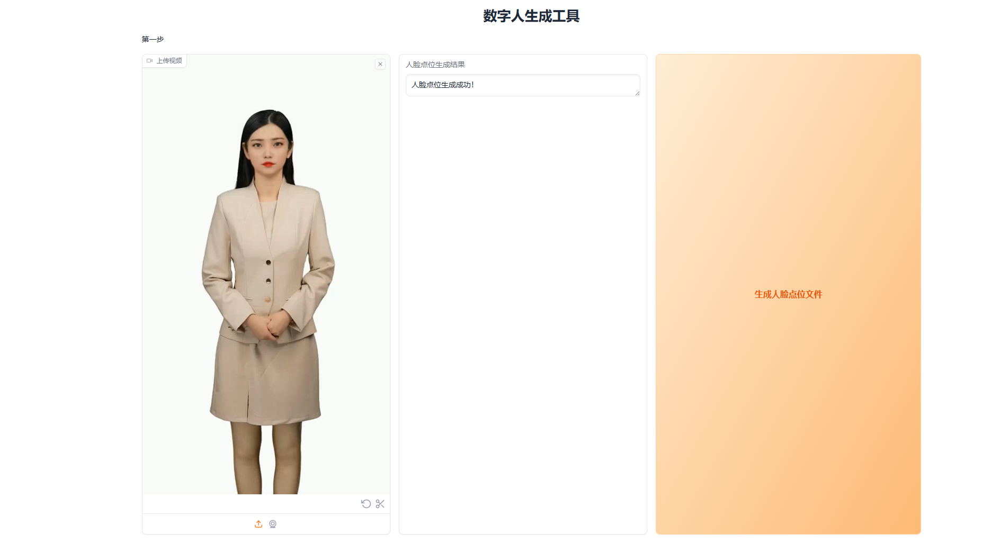

# Digital Human Generation Tool

## 项目简介

本项目是 DH_live 的改进版，增加了语音转文本功能，用于生成和处理数字人的音频生成，我写了一个gradio界面易于操作，我是编程小白代码有很多错误的地方欢迎提出，这个项目旨在为用户提供一个全面的解决方案，包括但不限于文本转语音、视频处理、模型训练和人脸生成等功能。

## 特别感谢

特别感谢kleinlee的开源https://github.com/kleinlee/DH_live.git

### 功能特点

- **视频处理**：支持对视频进行切割、合成和格式转换，适用于创建和编辑数字人类视频素材。
- **文本转语音**：包括多种预语言选择，后期更新可能会增加一些改进。
- **数字人合成**：选择好音频，开始合成数字人。
- **未来的改进**：预计未来会增加改进，比如，文本转语音，可能会增加一些其他的功能。

### 图片展示

以下是一些项目功能的示例截图：

1. **视频处理界面**

   
   *图1: 视频处理界面展示了如何使用工具对视频进行切割和合成。*

2. **文本转语音界面**

   
   *图2: 文本转语音界面展示了如何使用工具将文本转换为语音。*

3. **数字人合成界面**

   
   *图3: 数字人合成界面展示了如何生成和处理数字人图像。*

4. **未来的改进**

   
   *图4: 预计的未来改进和功能扩展。*

### 安装与使用

1. **环境要求**

   - **Python 版本**：需要 Python 3.10.6
   - **操作系统**：支持 Windows、macOS 和 Linux

2. **创建虚拟环境**

   推荐使用虚拟环境来隔离项目依赖。可以使用以下命令创建虚拟环境：

   ```bash

   git clone https://github.com/xingxing2233/Digital-human-generation-tool.git
   
   cd Digital-human-generation-tool

   
   python -m venv venv

   venv\Scripts\activate

   
   
   pip install -r requirements.txt


   python webapp.py


   打开浏览器http://127.0.0.1:7860


### 支持

如果需要可来知识星球一起探讨改进https://t.zsxq.com/lnroF
  


   
